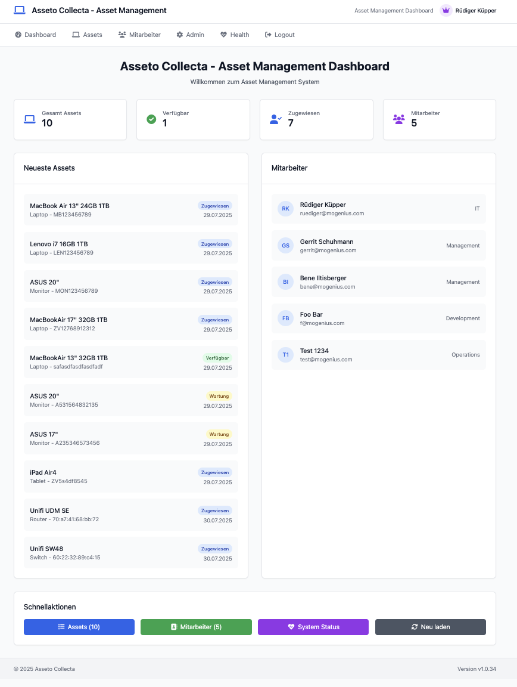
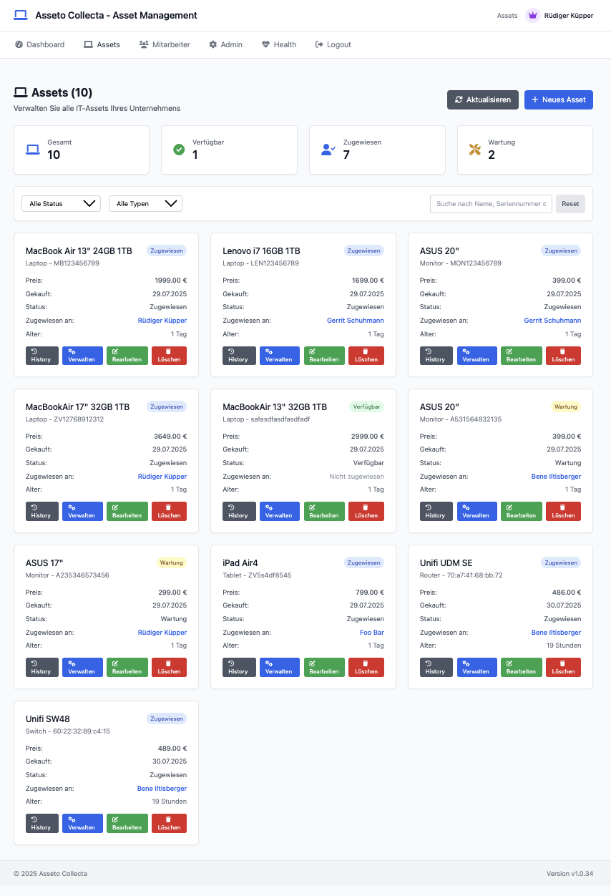
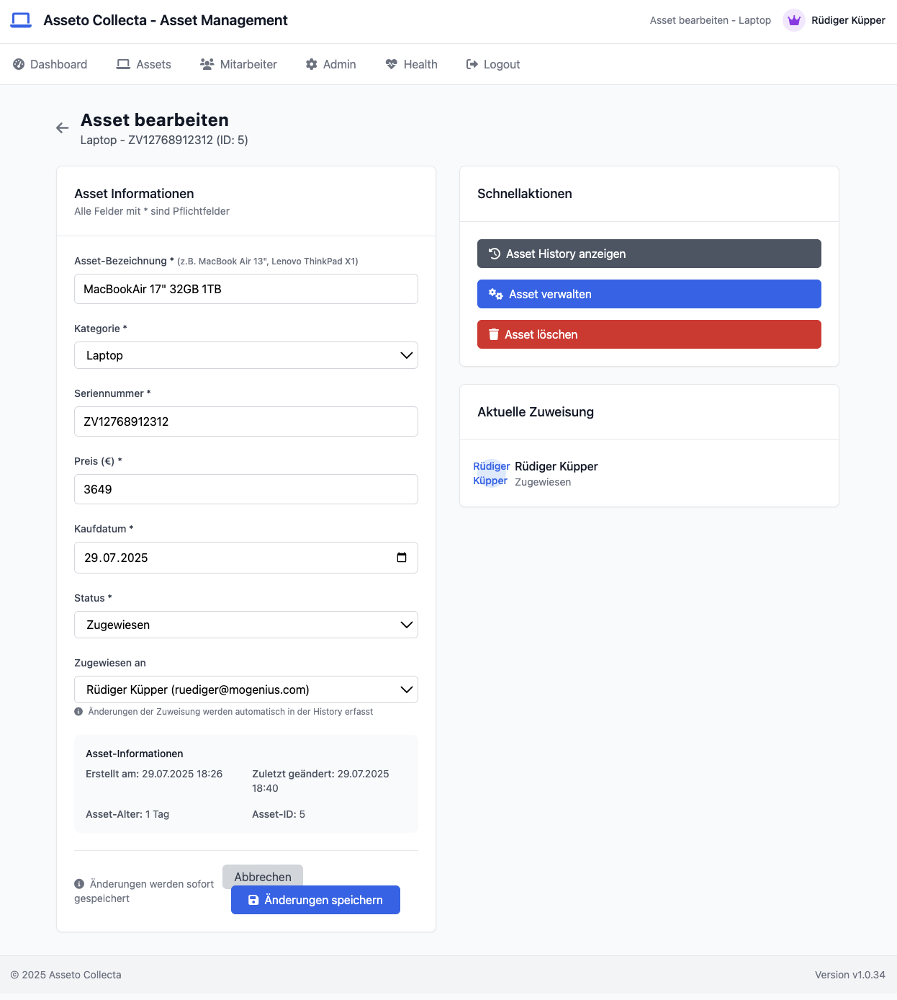
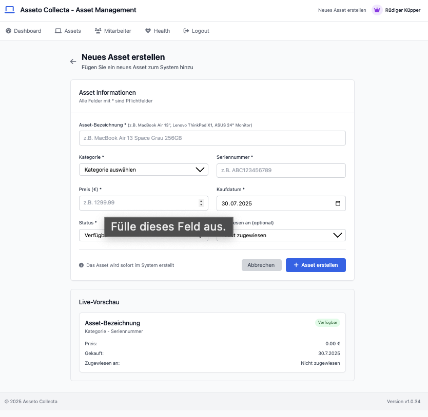
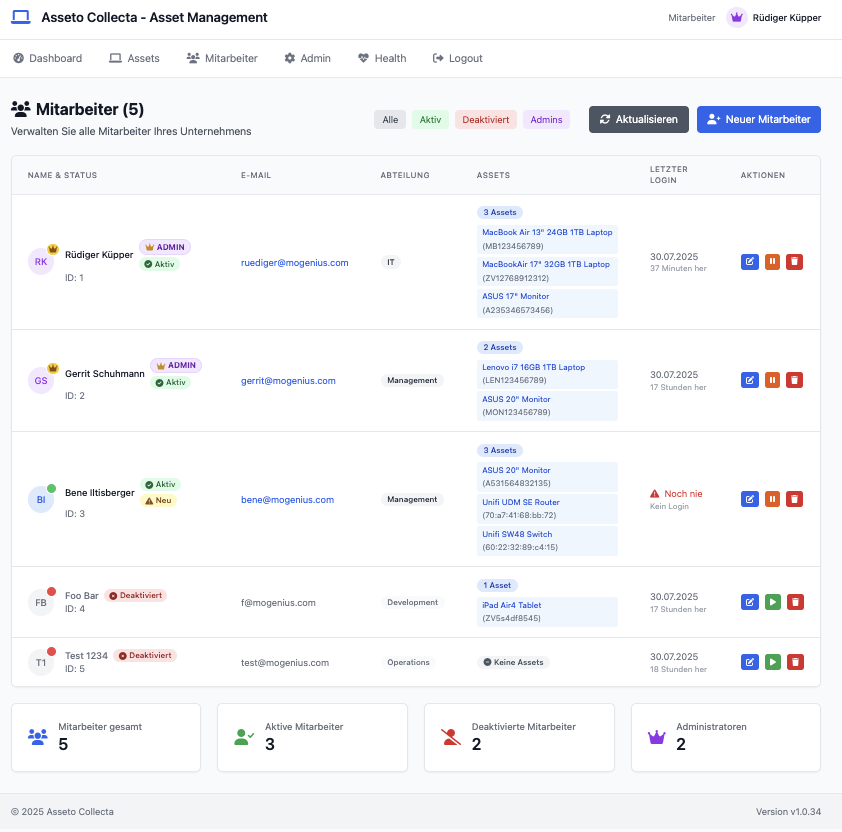
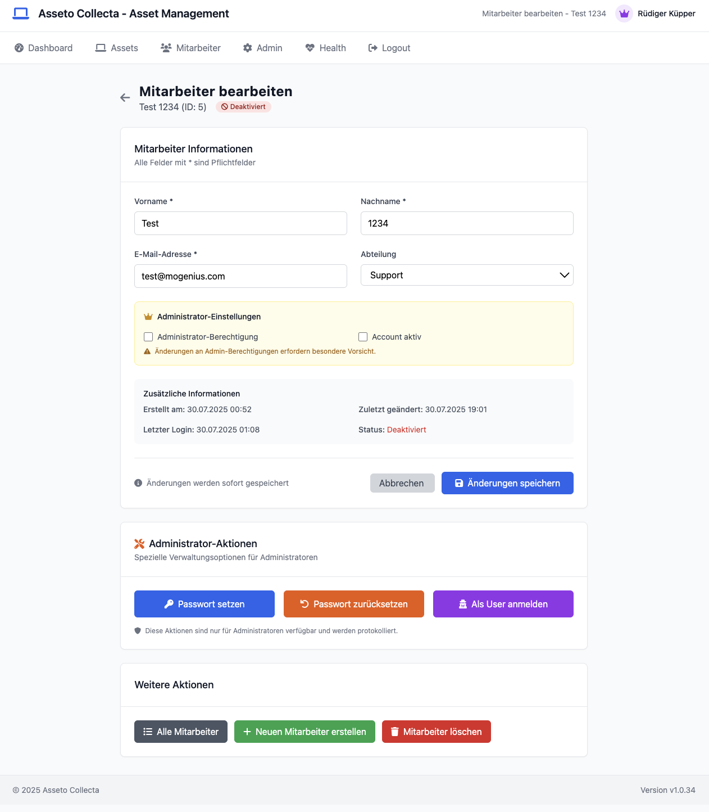
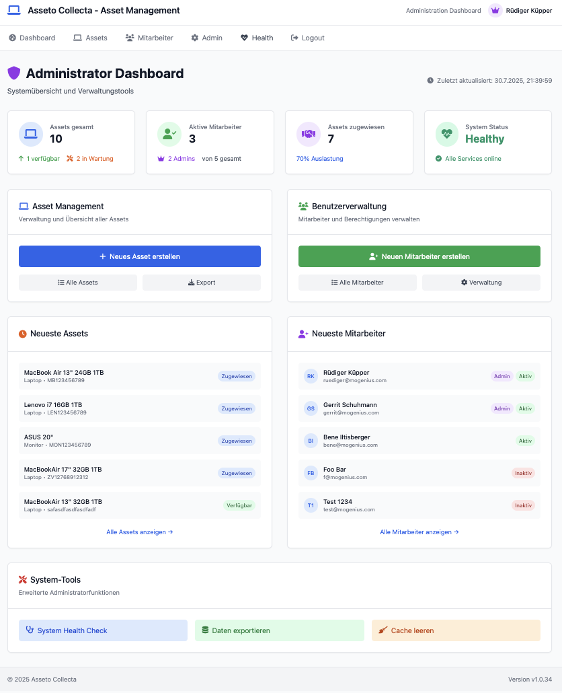
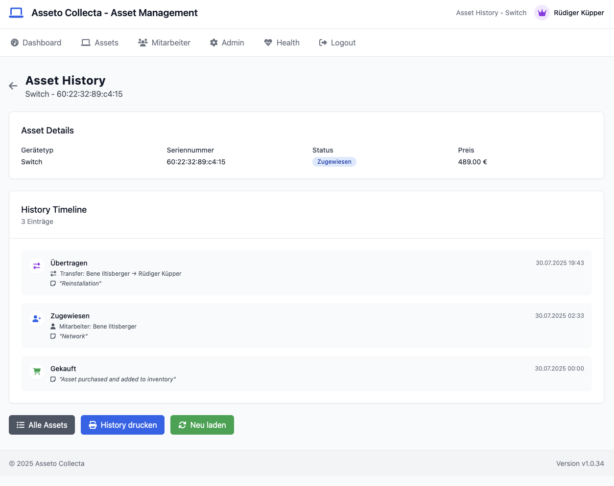

# Asseto Collecta - Asset Management

> **A comprehensive Asset Management System for efficient tracking and administration of company assets**

[](https://golang.org)
[](LICENSE)
[](https://docker.com)
[](#)

Asseto Collecta is a modern, web-based asset management system designed to help organizations efficiently track, manage, and administrate their IT assets and equipment. Built with Go and featuring a clean, responsive web interface, it provides comprehensive functionality for asset lifecycle management.

## 📋 Table of Contents

- [Features](#-features)
- [Architecture](#-architecture)
- [Prerequisites](#-prerequisites)
- [Quick Start](#-quick-start)
- [Installation](#-installation)
- [Configuration](#-configuration)
- [API Documentation](#-api-documentation)
- [Frontend Features](#-frontend-features)
- [Authentication & Security](#-authentication--security)
- [Database Schema](#-database-schema)
- [Docker Deployment](#-docker-deployment)
- [Development](#-development)
- [Contributing](#-contributing)
- [License](#-license)

## 🚀 Features

### Asset Management
- **Complete Asset Lifecycle**: Track assets from purchase to retirement
- **Asset Assignment**: Assign assets to employees with detailed history tracking
- **Asset Transfer**: Transfer assets between employees with audit trail
- **Asset History**: Complete historical record of all asset activities
- **Multiple Asset Types**: Support for laptops, desktops, mobile devices, and custom categories
- **Serial Number Management**: Automatic serial number generation and uniqueness validation
- **Status Tracking**: Available, Assigned, Maintenance, Retired status management






### Employee Management
- **Employee Profiles**: Comprehensive employee information management
- **Asset Assignment Tracking**: View all assets assigned to each employee
- **Department Organization**: Organize employees by departments
- **Active/Inactive Status**: Manage employee account status
- **Admin Role Management**: Granular admin permissions





### User Interface & Experience
- **Responsive Design**: Mobile-friendly interface using Tailwind CSS
- **Intuitive Dashboard**: Overview of assets, employees, and system statistics
- **Advanced Search & Filtering**: Quick asset and employee lookup
- **Real-time Updates**: Live status updates and notifications
- **Multi-language Support**: Currently German with extensible i18n framework





### Authentication & Security
- **JWT-based Authentication**: Secure token-based authentication system
- **Role-based Access Control**: Admin and regular user permissions
- **Session Management**: Secure session handling with automatic logout
- **Password Security**: Secure password hashing and management
- **API Security**: Protected API endpoints with token validation




### Reporting & Analytics
- **Asset Statistics**: Real-time asset distribution and status reports
- **Employee Statistics**: Active users and admin counts
- **Historical Reports**: Asset history and activity tracking
- **Export Capabilities**: Data export functionality



## 🏗 Architecture

Asseto Collecta follows a modern microservices architecture with clear separation of concerns:

```
┌─────────────────┐    ┌─────────────────┐    ┌─────────────────┐
│   Frontend      │    │   Backend API   │    │   Database      │
│   (Port 3000)   │◄──►│   (Port 8090)   │◄──►│   (MySQL)       │
│                 │    │                 │    │                 │
│ • Web Interface │    │ • REST API      │    │ • Asset Data    │
│ • User Auth     │    │ • JWT Auth      │    │ • User Data     │
│ • Asset Views   │    │ • Business Logic│    │ • History Logs  │
└─────────────────┘    └─────────────────┘    └─────────────────┘
```

### Technology Stack

**Backend:**
- **Language**: Go 1.24+
- **Framework**: Gin Web Framework
- **Database**: MySQL with GORM ORM
- **Authentication**: JWT tokens
- **API**: RESTful API design

**Frontend:**
- **Template Engine**: Go HTML Templates
- **CSS Framework**: Tailwind CSS
- **Icons**: Font Awesome
- **JavaScript**: Vanilla JS with modern features

**Infrastructure:**
- **Containerization**: Docker & Podman
- **Multi-Architecture**: ARM64 & AMD64 support
- **Reverse Proxy**: Compatible with Nginx, Traefik
- **Monitoring**: Health check endpoints

## 📋 Prerequisites

- **Go 1.24+** - [Download Go](https://golang.org/dl/)
- **MySQL 8.0+** - [Download MySQL](https://dev.mysql.com/downloads/)
- **Docker** (optional) - [Download Docker](https://www.docker.com/get-started)
- **Git** - [Download Git](https://git-scm.com/downloads)

## ⚡ Quick Start

### 1. Clone the Repository
```bash
git clone https://github.com/yourusername/asseto-collecta.git
cd asseto-collecta
```

### 2. Set Up Database
```sql
CREATE DATABASE asseto_collecta;
CREATE USER 'asseto_user'@'localhost' IDENTIFIED BY 'your_secure_password';
GRANT ALL PRIVILEGES ON asseto_collecta.* TO 'asseto_user'@'localhost';
FLUSH PRIVILEGES;
```

### 3. Configure Environment
```bash
# Copy example configuration
cp .env.example .env

# Edit configuration
vim .env
```

### 4. Run the Application
```bash
# Start backend
go run . --mode=backend --port=8090

# In another terminal, start frontend
go run . --mode=frontend --port=3000 --api=http://localhost:8090
```

### 5. Access the Application
- **Frontend**: http://localhost:3000
- **API Documentation**: http://localhost:8090/health
- **Admin Dashboard**: http://localhost:3000/admin

## 🔧 Installation

### Manual Installation

#### Backend Setup
```bash
# Navigate to backend directory
cd backend/

# Install dependencies
go mod tidy

# Run database migrations
go run . --migrate

# Start backend server
go run . --port=8090
```

#### Frontend Setup
```bash
# Navigate to frontend directory
cd frontend/

# Install dependencies
go mod tidy

# Start frontend server
go run . --port=3000 --api=http://localhost:8090
```

### Environment Variables

Create a `.env` file in the project root:

```env
# Database Configuration
DB_HOST=localhost
DB_PORT=3306
DB_USER=asseto_user
DB_PASSWORD=your_secure_password
DB_NAME=asseto_collecta

# JWT Configuration
JWT_SECRET=your_jwt_secret_key
JWT_EXPIRES_HOURS=24

# Server Configuration
BACKEND_PORT=8090
FRONTEND_PORT=3000
API_URL=http://localhost:8090

# Application Configuration
DEBUG=false
ENVIRONMENT=production
LOG_LEVEL=info
```

## ⚙ Configuration

### Backend Configuration

The backend supports various configuration options through environment variables or command-line flags:

```go
type Config struct {
    DBHost     string `env:"DB_HOST" default:"localhost"`
    DBPort     string `env:"DB_PORT" default:"3306"`
    DBUser     string `env:"DB_USER" required:"true"`
    DBPassword string `env:"DB_PASSWORD" required:"true"`
    DBName     string `env:"DB_NAME" required:"true"`
    
    JWTSecret      string `env:"JWT_SECRET" required:"true"`
    JWTExpiresHours int   `env:"JWT_EXPIRES_HOURS" default:"24"`
    
    Port        string `env:"PORT" default:"8090"`
    Environment string `env:"ENVIRONMENT" default:"development"`
    Debug       bool   `env:"DEBUG" default:"false"`
}
```

### Frontend Configuration

```go
type Config struct {
    APIUrl      string `env:"API_URL" default:"http://localhost:8090"`
    Port        string `env:"PORT" default:"3000"`
    Environment string `env:"ENVIRONMENT" default:"development"`
    Debug       bool   `env:"DEBUG" default:"false"`
}
```

## 🔌 API Documentation

### Authentication Endpoints

#### POST /auth/login
Authenticate user and receive JWT token.

**Request:**
```json
{
    "email": "user@example.com",
    "password": "secure_password"
}
```

**Response:**
```json
{
    "token": "eyJhbGciOiJIUzI1NiIsInR5cCI6IkpXVCJ9...",
    "employee": {
        "id": 1,
        "first_name": "John",
        "last_name": "Doe",
        "email": "john.doe@example.com",
        "is_admin": true,
        "is_active": true
    },
    "expires_at": "2024-07-31T17:30:00Z"
}
```

#### POST /auth/logout
Invalidate current session token.

### Asset Endpoints

#### GET /assets
Retrieve all assets with optional filtering.

**Query Parameters:**
- `status`: Filter by asset status (available, assigned, maintenance, retired)
- `type`: Filter by device type
- `employee_id`: Filter by assigned employee

**Response:**
```json
[
    {
        "id": 1,
        "name": "MacBook Pro 16\"",
        "device_type": "Laptop",
        "serial_number": "FVFXK2L3Q6LR",
        "purchase_date": "2024-01-15T00:00:00Z",
        "price": 2999.00,
        "status": "assigned",
        "current_user": 5,
        "created_at": "2024-01-15T10:30:00Z",
        "updated_at": "2024-07-20T14:22:00Z"
    }
]
```

#### POST /assets
Create a new asset.

**Request:**
```json
{
    "name": "Dell Laptop",
    "device_type": "Laptop",
    "serial_number": "DL123456789",
    "purchase_date": "2024-07-30T00:00:00Z",
    "price": 1299.99,
    "status": "available"
}
```

#### PUT /assets/{id}
Update an existing asset.

#### DELETE /assets/{id}
Delete an asset (admin only).

#### GET /assets/{id}/history
Get complete history of an asset.

**Response:**
```json
[
    {
        "id": 15,
        "asset_id": 1,
        "action": "assigned",
        "employee_id": 5,
        "date": "2024-07-20T14:22:00Z",
        "notes": "Initial assignment to new employee",
        "employee": {
            "first_name": "Jane",
            "last_name": "Smith",
            "email": "jane.smith@example.com"
        }
    }
]
```

#### POST /assets/{id}/assign
Assign asset to employee.

**Request:**
```json
{
    "employee_id": 5,
    "notes": "Assignment for new project"
}
```

#### POST /assets/{id}/unassign
Return asset to pool.

#### POST /assets/{id}/transfer
Transfer asset between employees.

### Employee Endpoints

#### GET /employees
Retrieve all employees.

#### POST /employees
Create new employee (admin only).

#### PUT /employees/{id}
Update employee information.

#### DELETE /employees/{id}
Delete employee (admin only).

#### POST /employees/{id}/set-password
Set employee password (admin only).

### Utility Endpoints

#### GET /health
System health check.

#### GET /user/profile
Get current user profile.

## 🎨 Frontend Features

### Dashboard
- **Asset Overview**: Visual statistics of asset distribution
- **Recent Activity**: Latest asset assignments and returns
- **Quick Actions**: Fast access to common operations
- **System Status**: Real-time system health indicators

### Asset Management Interface
- **Asset Listing**: Sortable, filterable asset table
- **Asset Details**: Comprehensive asset information views
- **Asset Forms**: Intuitive forms for creating and editing assets
- **History Tracking**: Visual timeline of asset activities
- **Assignment Management**: Easy asset assignment workflows

### Employee Management
- **Employee Directory**: Searchable employee listing
- **Employee Profiles**: Detailed employee information
- **Asset Assignments**: View all assets per employee
- **Permission Management**: Admin role assignment

### Advanced Features
- **Serial Number Generator**: Automatic unique serial number generation
- **Bulk Operations**: Multiple asset operations
- **Export Functions**: Data export capabilities
- **Responsive Design**: Mobile and tablet optimized
- **Dark Mode Support**: User preference-based theming

## 🔐 Authentication & Security

### JWT Token System
- **Secure Tokens**: HS256 algorithm with custom secrets
- **Token Expiration**: Configurable expiration times
- **Automatic Refresh**: Seamless token renewal
- **Secure Storage**: HttpOnly cookies for token storage

### Authorization Levels
- **Guest**: Login page access only
- **User**: View assets and employees, limited modifications
- **Admin**: Full system access, user management, asset CRUD operations

### Security Features
- **Password Hashing**: Bcrypt with configurable cost
- **Session Management**: Secure session handling
- **CORS Protection**: Configurable CORS policies
- **Rate Limiting**: API endpoint protection
- **Input Validation**: Comprehensive input sanitization
- **SQL Injection Protection**: Parameterized queries via GORM

### Security Headers
```go
// Security middleware implementation
c.Header("X-Content-Type-Options", "nosniff")
c.Header("X-Frame-Options", "DENY")
c.Header("X-XSS-Protection", "1; mode=block")
c.Header("Strict-Transport-Security", "max-age=31536000; includeSubDomains")
```

## 🗄 Database Schema

### Assets Table
```sql
CREATE TABLE assets (
    id BIGINT PRIMARY KEY AUTO_INCREMENT,
    name VARCHAR(255) NOT NULL,
    device_type VARCHAR(100) NOT NULL,
    serial_number VARCHAR(255) UNIQUE NOT NULL,
    purchase_date DATE NOT NULL,
    price DECIMAL(10,2) NOT NULL,
    status ENUM('available','assigned','maintenance','retired') DEFAULT 'available',
    current_user BIGINT NULL,
    created_at DATETIME DEFAULT CURRENT_TIMESTAMP,
    updated_at DATETIME DEFAULT CURRENT_TIMESTAMP ON UPDATE CURRENT_TIMESTAMP,
    
    INDEX idx_serial_number (serial_number),
    INDEX idx_status (status),
    INDEX idx_current_user (current_user),
    FOREIGN KEY (current_user) REFERENCES employees(id) ON DELETE SET NULL
);
```

### Employees Table
```sql
CREATE TABLE employees (
    id BIGINT PRIMARY KEY AUTO_INCREMENT,
    first_name VARCHAR(100) NOT NULL,
    last_name VARCHAR(100) NOT NULL,
    email VARCHAR(255) UNIQUE NOT NULL,
    department VARCHAR(100),
    password_hash VARCHAR(255) NOT NULL,
    is_admin BOOLEAN DEFAULT FALSE,
    is_active BOOLEAN DEFAULT TRUE,
    last_login DATETIME NULL,
    created_at DATETIME DEFAULT CURRENT_TIMESTAMP,
    updated_at DATETIME DEFAULT CURRENT_TIMESTAMP ON UPDATE CURRENT_TIMESTAMP,
    
    INDEX idx_email (email),
    INDEX idx_is_admin (is_admin),
    INDEX idx_is_active (is_active)
);
```

### Asset History Table
```sql
CREATE TABLE asset_histories (
    id BIGINT PRIMARY KEY AUTO_INCREMENT,
    asset_id BIGINT NOT NULL,
    action VARCHAR(50) NOT NULL,
    employee_id BIGINT NULL,
    from_user_id BIGINT NULL,
    to_user_id BIGINT NULL,
    date DATETIME DEFAULT CURRENT_TIMESTAMP,
    notes TEXT,
    created_at DATETIME DEFAULT CURRENT_TIMESTAMP,
    
    INDEX idx_asset_id (asset_id),
    INDEX idx_employee_id (employee_id),
    INDEX idx_date (date),
    FOREIGN KEY (asset_id) REFERENCES assets(id) ON DELETE CASCADE,
    FOREIGN KEY (employee_id) REFERENCES employees(id) ON DELETE SET NULL,
    FOREIGN KEY (from_user_id) REFERENCES employees(id) ON DELETE SET NULL,
    FOREIGN KEY (to_user_id) REFERENCES employees(id) ON DELETE SET NULL
);
```

## 🐳 Docker Deployment

### Multi-Architecture Docker Build

The application supports both ARM64 and AMD64 architectures:

```dockerfile
# Multi-Arch Dockerfile
ARG BUILDPLATFORM
FROM --platform=$BUILDPLATFORM golang:1.24-alpine AS builder

ARG TARGETPLATFORM
ARG TARGETOS
ARG TARGETARCH
ARG VERSION
ARG STAGE

ENV VERSION=${VERSION}
ENV APP_STAGE=${STAGE}

WORKDIR /app

# Dependencies
COPY go.mod go.sum ./
RUN go mod tidy

# Source code
COPY . .

# Cross-compile for target architecture
RUN CGO_ENABLED=0 GOOS=${TARGETOS} GOARCH=${TARGETARCH} go build \
    -a -installsuffix cgo \
    -ldflags "-extldflags '-static' -X main.Version=${VERSION} -X main.Stage=${STAGE}" \
    -o asseto-collecta .

# Runtime stage
FROM alpine:latest

ARG VERSION
ARG STAGE

ENV VERSION=${VERSION}
ENV STAGE=${STAGE}

# Security: Non-root user
RUN addgroup -g 1001 -S appgroup && \
    adduser -u 1001 -S appuser -G appgroup

# CA certificates for HTTPS
RUN apk --no-cache add ca-certificates tzdata

WORKDIR /app

# Copy binary and assets
COPY --from=builder /app/asseto-collecta .
COPY templates ./templates
COPY static ./static

# Set ownership
RUN chown -R appuser:appgroup /app

EXPOSE 3000
USER appuser

CMD ["./asseto-collecta"]
```

### Docker Compose Setup

```yaml
version: '3.8'

services:
  database:
    image: mysql:8.0
    environment:
      MYSQL_ROOT_PASSWORD: rootpassword
      MYSQL_DATABASE: asseto_collecta
      MYSQL_USER: asseto_user
      MYSQL_PASSWORD: secure_password
    volumes:
      - mysql_data:/var/lib/mysql
      - ./init.sql:/docker-entrypoint-initdb.d/init.sql
    ports:
      - "3306:3306"
    restart: unless-stopped

  backend:
    build:
      context: ./backend
      args:
        VERSION: v1.0.0
        STAGE: production
    environment:
      DB_HOST: database
      DB_PORT: 3306
      DB_USER: asseto_user
      DB_PASSWORD: secure_password
      DB_NAME: asseto_collecta
      JWT_SECRET: your_jwt_secret_here
      PORT: 8090
    ports:
      - "8090:8090"
    depends_on:
      - database
    restart: unless-stopped

  frontend:
    build:
      context: ./frontend
      args:
        VERSION: v1.0.0
        STAGE: production
    environment:
      API_URL: http://backend:8090
      PORT: 3000
    ports:
      - "3000:3000"
    depends_on:
      - backend
    restart: unless-stopped

  nginx:
    image: nginx:alpine
    volumes:
      - ./nginx.conf:/etc/nginx/nginx.conf
    ports:
      - "80:80"
      - "443:443"
    depends_on:
      - frontend
      - backend
    restart: unless-stopped

volumes:
  mysql_data:
```

### Building and Running

```bash
# Build multi-architecture images
V=24
podman build --no-cache --platform linux/arm64,linux/amd64 \
  --manifest "ghcr.io/yourusername/asseto-collecta:v0.0.${V}" \
  --build-arg VERSION=v0.0.${V} \
  --build-arg STAGE=prod \
  -f ./Dockerfile .

# Run with Docker Compose
docker-compose up -d

# Check status
docker-compose ps
```

## 🛠 Development

### Project Structure
```
asseto-collecta/
├── backend/
│   ├── main.go              # Backend entry point
│   ├── models.go            # Data models
│   ├── handlers.go          # API handlers
│   ├── auth.go              # Authentication logic
│   └── database.go          # Database configuration
├── frontend/
│   ├── main.go              # Frontend entry point
│   ├── handlers.go          # Route handlers
│   ├── auth.go              # Frontend auth logic
│   └── templates/           # HTML templates
│       ├── base.html        # Base template
│       ├── assets.html      # Asset views
│       └── employees.html   # Employee views
├── static/                  # Static assets
│   ├── css/                 # Stylesheets
│   ├── js/                  # JavaScript files
│   └── images/              # Images
├── docker-compose.yml       # Development environment
├── Dockerfile              # Production container
├── go.mod                  # Go module definition
└── README.md               # This file
```

### Development Setup

```bash
# Clone repository
git clone https://github.com/yourusername/asseto-collecta.git
cd asseto-collecta

# Install dependencies
go mod tidy

# Set up development database
docker-compose -f docker-compose.dev.yml up -d mysql

# Run backend in development mode
go run . --mode=backend --debug=true

# Run frontend in development mode (new terminal)
go run . --mode=frontend --debug=true --api=http://localhost:8090
```

### Code Style and Standards

#### Go Code Standards
- Follow official Go formatting (`gofmt`)
- Use meaningful variable and function names
- Add comprehensive comments for public functions
- Implement proper error handling
- Write unit tests for critical functions

#### Git Workflow
```bash
# Feature development
git checkout -b feature/new-asset-feature
git add .
git commit -m "feat: add bulk asset import functionality"
git push origin feature/new-asset-feature

# Create pull request
```

#### Commit Message Convention
```
feat: add new feature
fix: bug fix
docs: documentation changes
style: formatting changes
refactor: code refactoring
test: adding tests
chore: maintenance tasks
```

### Testing

```bash
# Run all tests
go test ./...

# Run tests with coverage
go test -cover ./...

# Run specific test
go test -run TestAssetCreation ./...

# Benchmark tests
go test -bench=. ./...
```

### API Testing

Use the included Postman collection or curl commands:

```bash
# Login and get token
TOKEN=$(curl -s -X POST http://localhost:8090/auth/login \
  -H "Content-Type: application/json" \
  -d '{"email":"admin@example.com","password":"password"}' \
  | jq -r '.token')

# Use token for authenticated requests
curl -H "Authorization: Bearer $TOKEN" \
  http://localhost:8090/assets
```

## 🤝 Contributing

We welcome contributions to Asseto Collecta! Here's how you can help:

### Getting Started
1. Fork the repository
2. Create a feature branch (`git checkout -b feature/amazing-feature`)
3. Make your changes
4. Add tests for new functionality
5. Ensure all tests pass
6. Commit your changes (`git commit -m 'feat: add amazing feature'`)
7. Push to the branch (`git push origin feature/amazing-feature`)
8. Open a Pull Request

### Contribution Guidelines
- **Code Quality**: Ensure code follows Go best practices
- **Testing**: Add tests for new features and bug fixes
- **Documentation**: Update documentation for API changes
- **Compatibility**: Maintain backward compatibility when possible
- **Security**: Follow security best practices

### Types of Contributions
- 🐛 **Bug Reports**: Help us identify and fix issues
- 💡 **Feature Requests**: Suggest new functionality
- 📖 **Documentation**: Improve documentation and examples
- 🔧 **Code Improvements**: Optimize performance and maintainability
- 🌐 **Translations**: Add support for additional languages

### Development Environment
Before contributing, please:
1. Set up the development environment as described above
2. Run the test suite to ensure everything works
3. Check code formatting with `gofmt`
4. Ensure your changes don't introduce security vulnerabilities

## 📄 License

This project is licensed under the MIT License - see the [LICENSE](LICENSE) file for details.

```
MIT License

Copyright (c) 2024 Asseto Collecta Contributors

Permission is hereby granted, free of charge, to any person obtaining a copy
of this software and associated documentation files (the "Software"), to deal
in the Software without restriction, including without limitation the rights
to use, copy, modify, merge, publish, distribute, sublicense, and/or sell
copies of the Software, and to permit persons to whom the Software is
furnished to do so, subject to the following conditions:

The above copyright notice and this permission notice shall be included in all
copies or substantial portions of the Software.

THE SOFTWARE IS PROVIDED "AS IS", WITHOUT WARRANTY OF ANY KIND, EXPRESS OR
IMPLIED, INCLUDING BUT NOT LIMITED TO THE WARRANTIES OF MERCHANTABILITY,
FITNESS FOR A PARTICULAR PURPOSE AND NONINFRINGEMENT. IN NO EVENT SHALL THE
AUTHORS OR COPYRIGHT HOLDERS BE LIABLE FOR ANY CLAIM, DAMAGES OR OTHER
LIABILITY, WHETHER IN AN ACTION OF CONTRACT, TORT OR OTHERWISE, ARISING FROM,
OUT OF OR IN CONNECTION WITH THE SOFTWARE OR THE USE OR OTHER DEALINGS IN THE
SOFTWARE.
```

---

## 🙋‍♂️ Support & Contact

- **Documentation**: Check this README and inline code comments
- **Issues**: Report bugs via [GitHub Issues](https://github.com/yourusername/asseto-collecta/issues)
- **Discussions**: Join conversations in [GitHub Discussions](https://github.com/yourusername/asseto-collecta/discussions)
- **Email**: For security issues, email [security@asseto-collecta.com](mailto:security@asseto-collecta.com)

---

**Made with ❤️ by the Asseto Collecta Team**

*Efficiently managing assets, one deployment at a time.*